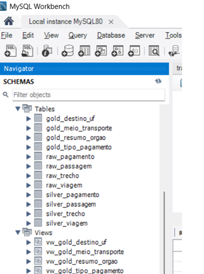

# Análise de Viagens a Serviço - Portal da Transparência

## Sobre o Projeto

Este projeto tem como objetivo realizar uma análise de dados de viagens a serviço utilizando dados públicos disponibilizados pelo Portal da Transparência.

Foi desenvolvida uma pipeline de dados utilizando a arquitetura **Medallion**, passando pelas camadas:

- **Raw**: armazenamento dos dados originais.
- **Silver**: tratamento, padronização e aplicação de regras de negócio.
- **Gold**: criação de tabelas analíticas para responder perguntas de negócio.

O projeto foi desenvolvido utilizando Python, SQL, MySQL, Pandas e Jupyter Notebook.

---

# Arquitetura de Dados

A solução segue o modelo de camadas:

```
Dados CSV
   |
   v
RAW
   |
   v
SILVER
   |
   v
GOLD
   |
   v
Análises e Visualizações
```

## Modelo do Banco de Dados



---

# Camada Raw

A camada Raw representa os dados extraídos dos arquivos originais, mantendo a estrutura inicial sem alterações.

Tabelas:

- `raw_viagem`
- `raw_pagamento`
- `raw_passagem`
- `raw_trecho`

Características:

- Dados carregados diretamente dos arquivos CSV.
- Campos mantidos no formato original.
- Sem aplicação de regras de negócio.

---

# Camada Silver

A camada Silver realiza o tratamento e preparação dos dados para análise.

Processos realizados:

- Conversão de tipos de dados.
- Padronização de informações.
- Tratamento de valores nulos.
- Criação de chaves primárias e relacionamentos.
- Aplicação de restrições.
- Criação de campos calculados.

Tabelas:

- `silver_viagem`
- `silver_pagamento`
- `silver_passagem`
- `silver_trecho`

Campos calculados:

- `valor_total`
- `duracao_dias`

A tabela `silver_viagem` concentra as informações principais das viagens e foi utilizada para responder as primeiras análises.

---

# Camada Gold

A camada Gold foi criada para disponibilizar informações agregadas e prontas para análise.

## Perguntas 1, 2 e 3

As consultas foram realizadas utilizando principalmente a tabela:

```
silver_viagem
```

### Pergunta 1

**Quais órgãos possuem maior custo total em viagens?**

Análise utilizando:

- órgão responsável;
- soma do valor_total das viagens.

---

### Pergunta 2

**Quais destinos apresentam maior custo médio por viagem?**

Análise utilizando:

- destino;
- média do valor_total.

---

### Pergunta 3

**Qual foi a viagem de maior duração e seu custo total?**

Análise utilizando:

- duração da viagem;
- valor_total.

---

# Tabelas Gold Analíticas

Foram criadas tabelas específicas para responder perguntas de negócio.

---

## gold_tipo_pagamento

Utilizada para responder:

**Qual tipo de pagamento possui maior valor médio?**

Origem:

- `silver_pagamento`

Tratamento realizado:

- agrupamento por tipo de pagamento;
- cálculo do valor médio.

---

## gold_meio_transporte

Utilizada para responder:

**Qual meio de transporte foi mais utilizado nos trechos?**

Origem:

- `silver_trecho`

Tratamento realizado:

- contagem dos meios de transporte utilizados.

---

## gold_destino_uf

Utilizada para responder:

**Qual UF de destino possui maior quantidade de trechos?**

Origem:

- `silver_trecho`

Tratamento realizado:

- agrupamento por UF;
- contagem de ocorrências.

---

# Gold com JOIN

## gold_resumo_orgao

Criada para responder:

**Qual órgão apresentou o maior gasto total em viagens?**

Esta tabela consolida informações financeiras utilizando relacionamento entre tabelas Silver.

Relacionamentos utilizados:

- `silver_viagem`
- `silver_pagamento`

O objetivo foi criar uma visão analítica consolidada por órgão.

---

# Views Analíticas

Foram criadas views para facilitar o acesso aos resultados Gold:

- `vw_gold_resumo_orgao`
- `vw_gold_tipo_pagamento`
- `vw_gold_meio_transporte`
- `vw_gold_destino_uf`

As views permitem consultas mais simples sem necessidade de executar novamente toda a lógica de agregação.

---

# Pipeline do Projeto

## 1 - Extração

Script responsável por:

- baixar os arquivos;
- realizar leitura dos CSVs;
- carregar os dados na camada Raw.

Arquivo:

```
1_extrair.py
```

---

## 2 - Transformação

Script responsável por:

- transformar dados Raw em Silver;
- aplicar regras de negócio;
- criar campos calculados.

Arquivo:

```
2_transformar.py
```

---

## 3 - Análise

Notebook responsável por:

- executar consultas Gold;
- validar resultados;
- gerar gráficos;
- realizar análises.

Arquivo:

```
3_analise.ipynb
```

---

# Tecnologias Utilizadas

- Python
- Pandas
- MySQL
- SQL
- Jupyter Notebook
- Git
- GitHub

---

# Como Executar o Projeto

## Instalar dependências

```bash
pip install -r requirements.txt
```

## Configurar ambiente

Criar arquivo `.env` contendo as informações de conexão com o banco.

## Executar extração

```bash
python 1_extrair.py
```

## Executar transformação

```bash
python 2_transformar.py
```

## Executar análise

Abrir:

```
3_analise.ipynb
```

---

# Resultados Obtidos

O projeto possibilitou analisar:

- órgãos com maiores custos;
- destinos com maior custo médio;
- viagens com maior duração;
- tipos de pagamento;
- meios de transporte utilizados;
- principais destinos por UF;
- consolidação de gastos por órgão.

---

# Estrutura Final do Banco

### Raw

- raw_viagem
- raw_pagamento
- raw_passagem
- raw_trecho


### Silver

- silver_viagem
- silver_pagamento
- silver_passagem
- silver_trecho


### Gold

- gold_destino_uf
- gold_meio_transporte
- gold_tipo_pagamento
- gold_resumo_orgao


### Views

- vw_gold_destino_uf
- vw_gold_meio_transporte
- vw_gold_tipo_pagamento
- vw_gold_resumo_orgao